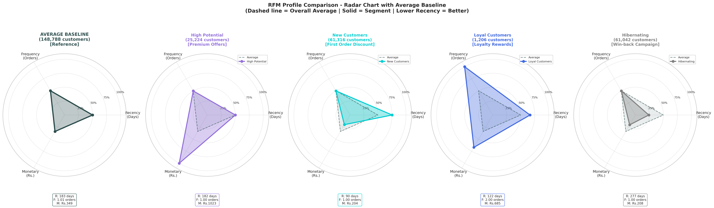
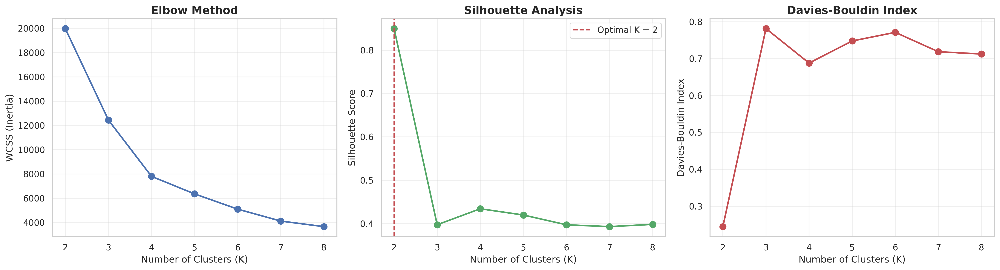

# NCR 网约车数据分析报告
## 2024年度运营分析与2025年Q1预测

**数据规模**: 150,000订单 | 148,788客户 | 2024全年

---

# 📋 目录

1. **执行摘要** - 核心发现速览
2. **客户行为分析** - 订单状态、时间分布、Top10客户、评分
3. **地理时空分析** - Top10热门区域、时空热力图、距离分布
4. **RFM客户细分** - K=4聚类、4类客群画像
5. **收入预测** - 2025年Q1预测、模型验证
6. **综合仪表板** - 全局监控视图
7. **业务建议** - 短中长期策略

---

# 📊 执行摘要

| 模块 | 关键发现 | 业务价值 |
|------|----------|----------|
| 客户行为 | 早晚高峰占40%+订单 | 司机调度优化 |
| 地理时空 | Top10热门区域识别 | 车辆预部署 |
| RFM细分 | K=4聚类，4类客群 | 差异化营销 |
| 收入预测 | Q1预测Rs.12.26M | 财务规划 |

**核心指标**: ARIMA误差13.62% | Top10区域覆盖 | 4类客群分层

---

# 📊 模块1: 客户行为分析

**7个子图 (4行×2列)**:
1. 订单状态分布
2. Top10消费客户
3. 客户留存分析
4. 评分双密度图
5. Top10客户详情表
6. 24小时订单分布
7. 行程距离×车型分析

---

# 子图1-2: 订单状态 & Top10客户

**子图1 - 订单状态分布**:
- Completed/Cancelled分布
- 取消率监控指标

**子图2 - Top10消费客户**:
- 高价值客户识别
- VIP服务目标群体

---

# 子图3-4: 留存分析 & 评分分布

**子图3 - 客户留存分析**:
- 单次/2次/3次乘客占比
- 复购率指标

**子图4 - 评分双密度图**:
- 司机评分 vs 客户评分
- 双向服务质量监控

---

# 子图5: Top10客户详情表

**详细客户画像**:
| 指标 | 内容 |
|------|------|
| Customer ID | 客户唯一标识 |
| Total Spend | 总消费金额 |
| Rides | 乘车次数 |
| Avg/Ride | 单均消费 |
| Avg Dist | 平均行程距离 |
| Pattern | 行为模式标签 |

---

# 子图6-7: 时间偏好 & 距离分布

**子图6 - 24小时订单分布**:
- 早高峰(6-10): 红色
- 午间(10-17): 蓝色
- 晚高峰(17-21): 橙色
- 夜间(21-6): 灰色

**子图7 - 行程距离分类**:
- Short(0-5km) / Medium(5-10km) / Long(10-20km) / Very Long(20-50km)

---

# 📊 模块2: 地理时空分析

**4个子图 (2行×2列)**:
1. Top10上车点（左上）
2. Top10下车点（右上）
3. 时空热力图（左下）
4. 路线热力矩阵（右下）

---

# 子图1-2: Top10热门区域

**Top10上车点**:
- 商圈/写字楼
- 交通枢纽
- 居民区

**Top10下车点**:
- CBD/科技园
- 商业餐饮区
- 旅游景点

**应用**: 司机待命点推荐 + 返程订单匹配

---

# 子图3-4: 时空热力 & 路线矩阵

**子图3 - 时空热力图**:
- X轴: 24小时
- Y轴: 星期几
- 颜色: 订单密度

**子图4 - OD路线矩阵**:
- 上车点 × 下车点
- 热门路线识别
- 拼车路线设计依据

---

# 📊 模块3: RFM客户细分

**RFM定义**:
- **R**ecency: 最近消费距今天数
- **F**requency: 消费频次  
- **M**onetary: 消费金额

**K-Means聚类**: K=4

---

# K=4 聚类结果

**4类客户画像 (5个雷达子图)**:

| 簇 | 名称 | 人数 | 占比 |
|---|------|------|------|
| 0 | High Potential | 25,224 | 17% |
| 1 | New Customers | 61,316 | 41% |
| 2 | Loyal Customers | 1,206 | 1% |
| 3 | Hibernating | 61,042 | 41% |

---

# 聚类轮廓详解: 4类客群

| 客群 | R特征 | F特征 | M特征 | 策略 |
|------|-------|-------|-------|------|
| High Potential | 中(182天) | 单次 | 高(Rs.1023) | 升级培育 |
| New Customers | 低(90天) | 单次 | 低(Rs.204) | 首乘激励 |
| Loyal Customers | 中(122天) | 多次(≈2) | 中(Rs.685) | VIP待遇 |
| Hibernating | 高(277天) | 单次 | 低(Rs.208) | 激活唤醒 |

---

# K值选择: 肘部法 & 轮廓系数

**3个子图 (1行×3列)**:

1. **Elbow Method (WCSS)**
   - K=4处惯性下降趋缓

2. **Silhouette Score**
   - K=3-5得分较高

3. **Davies-Bouldin Index**
   - 越低越好

**结论**: 综合考虑选择K=4

---

# 3D聚类可视化

**空间分布洞察**:
- X轴: Recency（天数）
- Y轴: Frequency（次数）
- Z轴: Monetary（金额）
- 颜色: 4类客群

**应用**: 客户迁移追踪 + 流失预警

---

# 📊 模块4: 收入预测

**8个子图布局**:
- 历史趋势（左上2格）
- 方法说明（右上1格）
- 多模型预测（第2行）
- 误差指标4面板（第3行左）
- 日波动图（第3行右）
- 模型验证（第4行左）
- 雷达图（第4行中）
- 总结（第4行右）

---

# 子图1-2: 历史趋势 & 方法说明

**历史月度收入**:
- 2024年12个月柱状图
- 趋势线斜率

**日度→月度方法**:
- 训练: 365天日数据
- 优势: 30倍数据点
- 聚合: 日预测→月汇总

---

# 子图3: 多模型预测对比

**2025年Q1预测**:

| 月份 | ARIMA | ExpSmooth | Prophet | 集成 |
|------|-------|-----------|---------|------|
| 1月 | 4.09M | 3.98M | 4.15M | 4.09M |
| 2月 | 3.81M | 3.75M | 3.92M | 3.81M |
| 3月 | 4.37M | 4.28M | 4.41M | 4.37M |

**Q1总计**: Rs.12.26M

---

# 子图4: 模型误差指标

**4个子面板 (MAPE/MAE/RMSE/R²)**:

| 模型 | MAPE | 评价 |
|------|------|------|
| ARIMA | 13.62% | ⭐⭐⭐⭐⭐ |
| ExpSmooth | 18.91% | ⭐⭐⭐⭐ |
| Prophet | 49.13% | ⭐⭐ |

**结论**: 生产环境使用ARIMA

---

# 子图5-6: 日波动 & 模型验证

**子图5 - 日收入波动**:
- 365天散点+7日均线
- 识别异常波动日

**子图6 - 模型验证**:
- 验证集: 2024年10-12月
- ARIMA偏差<10%
- 验证通过 ✓

---

# 📊 模块5: 综合仪表板

**12面板集成视图**

适合管理层日常监控

---

# 仪表板面板说明

| 行 | 左 | 中左 | 中右 | 右 |
|---|---|---|---|---|
| 1 | KPI汇总 | 订单状态 | 每日趋势 | 星期分布 |
| 2 | 小时分布 | 收入趋势 | 车型分布 | 支付方式 |
| 3 | 取消原因 | 距离分布 | 评分分布 | 热门地点 |

---

# 💡 业务建议: 短期（1-3个月）

| 领域 | 建议 | 预期效果 |
|------|------|----------|
| 高峰激励 | 司机补贴+10-15% | 接单率提升 |
| 区域调度 | Top10区域车辆预部署 | 空驶率降低20% |
| 服务改进 | 低分订单72小时回访 | 满意度提升 |
| 支付优化 | 电子支付首单立减 | 电子支付占比↑ |

---

# 💡 业务建议: 中期（3-6个月）

| 领域 | 建议 |
|------|------|
| VIP客户 | Loyal Customers专属客服、优先派单 |
| 客户激活 | Hibernating定向优惠券推送 |
| 新客培育 | New Customers→High Potential转化 |
| 动态定价 | 时空热力图+实时价格调整 |

---

# 💡 业务建议: 长期（6-12个月）

| 领域 | 建议 |
|------|------|
| 实时监控 | 每日仪表板推送至管理层 |
| 智能调度 | 机器学习预测订单热点 |
| 滚动预测 | ARIMA月度更新收入预测 |
| 客户画像 | RFM+行为数据千人千面 |

---

# 🎯 总结

## 核心成果

1. **客户行为清晰化**: 高峰时段(8-10点/18-20点)占40%订单
2. **客户价值量化**: K-Means(K=4)聚类，4类客群差异化运营
3. **地理热力可视**: Top10上下车点识别，时空热力矩阵
4. **收入可预测**: ARIMA误差13.62%，Q1预测Rs.12.26M

---

# 🎯 下一步行动

- ✅ 部署实时仪表板监控系统
- ✅ 启动Loyal Customers VIP计划
- ✅ 基于ARIMA建立月度收入预测
- ✅ Hibernating客户激活活动

---

# 谢谢！

## NCR网约车数据分析报告

**分析工具**: Python 3.10 + Pandas + Matplotlib + Scikit-learn

**数据来源**: NCR网约车平台2024年运营数据

---
